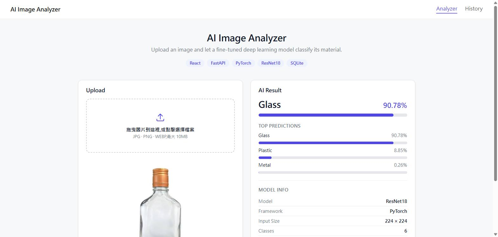
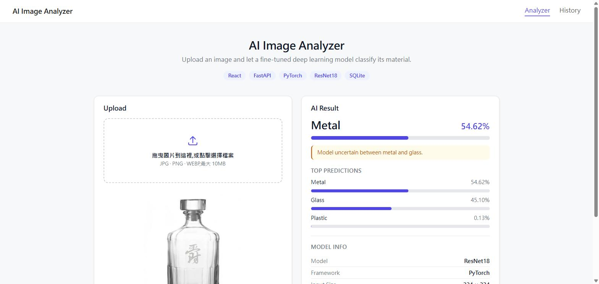
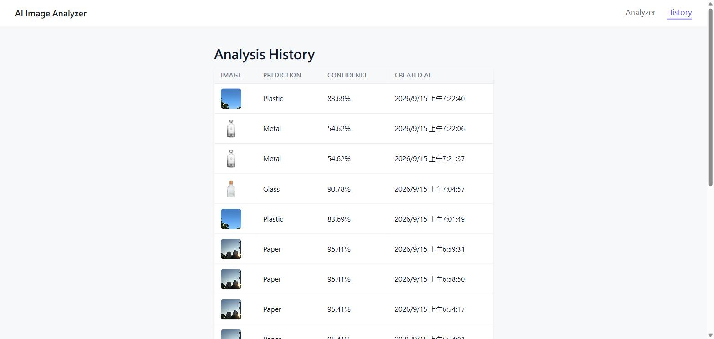
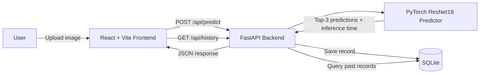
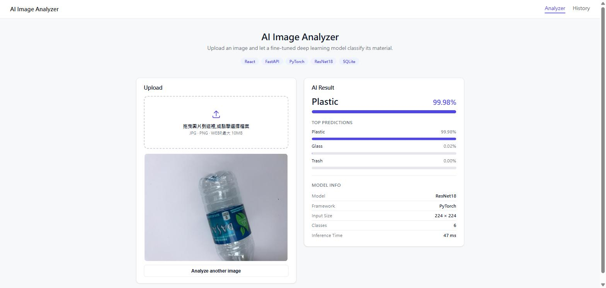
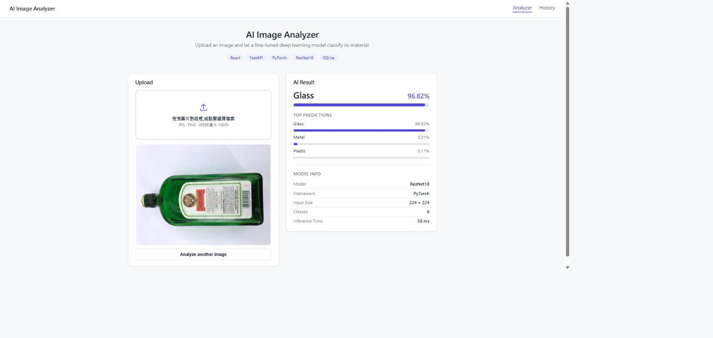

# AI Image Analysis


A full-stack computer vision application built with React, FastAPI, PyTorch and ResNet18. The system allows users to upload images, performs deep-learning inference through a REST API, and displays ranked predictions with confidence scores.

**Built an end-to-end image classification system using PyTorch, ResNet18, FastAPI, React, and SQLite; improved test accuracy from 75.5% to 88.7% through fine-tuning, class-weighted loss, and data augmentation.**



The model classifies an uploaded image into one of six recyclable material categories — **cardboard, glass, metal, paper, plastic, trash** — trained on the [TrashNet](https://github.com/garythung/trashnet) dataset using transfer learning on ResNet18.

## Screenshots

**Low-confidence prediction, surfaced explicitly to the user** — a glass decanter with a highly reflective metallic-looking cap, where the model is genuinely torn between two classes. See [Model Performance & Error Analysis](#model-performance--error-analysis) for the full discussion.



**Analysis history** — every prediction is persisted and browsable:



## Tech Stack

| Layer | Technology |
|---|---|
| Frontend | React, Vite, React Router |
| Backend | FastAPI, Uvicorn, SQLAlchemy |
| Model | PyTorch, torchvision, ResNet18 (transfer learning) |
| Database | SQLite |
| Training | Google Colab (GPU), TrashNet dataset |
| Version Control | Git + GitHub |

## Architecture



The frontend and backend are decoupled: the frontend never talks to the model directly, and the model is loaded once at backend startup (not per-request) so inference stays fast.

## Model Training Pipeline

Training was done in Google Colab (GPU runtime) and lives in [`training/train.ipynb`](training/train.ipynb).

1. **Dataset** — TrashNet, 2,527 images across 6 classes. Split 70 / 15 / 15 into train / validation / test (1,768 / 379 / 380 images). The `trash` class is heavily underrepresented (~137 images vs. 400–600 for other classes).
2. **Preprocessing** — resize to 224×224, normalize with ImageNet mean/std (required to match ResNet18's pretrained weights). Training augmentation: random horizontal flip, random rotation, color jitter.
3. **Stage 1 — classifier head only.** ResNet18 pretrained on ImageNet, backbone fully frozen, only the final `fc` layer retrained (6-way classifier). 10 epochs, Adam, lr=1e-3.
4. **Stage 2 — fine-tuning.** Loaded the Stage 1 checkpoint and unfroze `layer4` (the last residual block) in addition to `fc`, using differential learning rates (`layer4`: 1e-4, `fc`: 1e-3). Added **class weights** to the loss (inversely proportional to class frequency) to counter the `trash` class imbalance, and a `ReduceLROnPlateau` scheduler. Trained for 20 epochs; the checkpoint is the epoch with the best validation accuracy, not the final epoch.

## Model Performance & Error Analysis

| Metric | Stage 1 (frozen backbone) | Stage 2 (fine-tuned) |
|---|---|---|
| Test accuracy | 75.5% | **88.7%** |

Per-class precision / recall (test set, 380 images):

| Class | Stage 1 P / R | Stage 2 P / R |
|---|---|---|
| cardboard | 0.95 / 0.76 | 0.96 / 0.88 |
| glass | 0.83 / 0.65 | 0.88 / 0.86 |
| metal | 0.71 / 0.82 | 0.88 / 0.97 |
| paper | 0.84 / 0.81 | 0.91 / 0.92 |
| plastic | 0.61 / 0.80 | 0.86 / 0.80 |
| trash | 0.62 / 0.58 | 0.79 / 0.88 |

Fine-tuning `layer4` plus class-weighted loss lifted every class, with the largest gains on the two weakest categories: `trash` (the smallest class) and `plastic` (which was previously over-predicted as a catch-all, dragging its precision down to 0.61).

### A closer look at one uncertain prediction

The app surfaces low-confidence predictions directly in the UI instead of hiding them behind a falsely confident number (see `getConfidenceNotice` in `frontend/src/pages/Analyzer.jsx`): if the top prediction is below 50% confidence, or the gap to the second-place class is under 15 points, the UI shows an explicit "model is uncertain" banner.

Two real predictions from this app illustrate why that matters:

- A **glass flask with a copper metal cap** → predicted `glass` at 90.8% confidence (metal only 0.3%). Correct, and confidently so.
- A **glass decanter with a glass stopper**, photographed against a plain background → predicted `metal` at 54.6%, with `glass` a close second at 45.1%.

The decanter is visually different from most of the `glass` training images in one specific way: its faceted glass stopper and neck catch light in sharp, bright specular highlights — the same visual signature (bright, hard-edged reflections on a smooth surface) that distinguishes `metal` objects in the training set. Without a wider variety of glass objects with strong specular highlights, the model has learned "sharp reflections → metal" as a shortcut that misfires on glassware shaped like this.

This is a normal failure mode for a model trained on ~2,500 images, and it is a much better outcome than the same model confidently guessing the wrong class. Ways to close this gap:

- Add more `glass` training images with strong specular highlights (bottle caps, stoppers, curved necks) so the model stops associating that visual cue with `metal` alone.
- Add [Grad-CAM](https://arxiv.org/abs/1610.02391) to visualize which pixels drove the `metal` prediction, to confirm (rather than hypothesize) that the reflective highlight is what the model is keying on.
- Try a deeper backbone (ResNet34/50) or higher input resolution, since fine material texture is exactly the kind of detail 224×224 ResNet18 can lose.

### Verifying the reported accuracy live

The 88.7% figure above comes from a batch evaluation script in `training/train.ipynb`. To confirm the deployed app (not just the offline evaluation) matches that number, I ran two held-out TrashNet source images through the live app:

| Photo | True class | Predicted | Confidence |
|---|---|---|---|
| Crushed water bottle (TrashNet, `plastic`) | plastic | plastic | 99.98% |
| Green liquor bottle (TrashNet, `glass`) | glass | glass | 96.82% |




Both are classified correctly with very high confidence, end-to-end through the actual REST API — matching the offline evaluation and confirming there's no train/serve skew between the notebook and the deployed `predictor.py`.

## Project Structure

```
ai-image-analysis/
├── backend/
│   ├── main.py                 # FastAPI app: /api/predict, /api/history, /api/model-info
│   ├── services/
│   │   └── predictor.py        # Loads the model once at startup; runs inference
│   ├── database/
│   │   ├── db.py                # SQLAlchemy engine/session (SQLite)
│   │   └── models.py            # PredictionRecord table
│   ├── model/                   # best_model.pth + labels.json (trained weights)
│   ├── uploads/                  # Uploaded images, served as static files
│   └── requirements.txt
├── frontend/
│   ├── src/
│   │   ├── pages/
│   │   │   ├── Analyzer.jsx      # Upload + result UI
│   │   │   └── History.jsx       # Past predictions table
│   │   ├── components/           # UploadBox, ConfidenceBar, ModelInfoCard, TechBadges
│   │   └── api.js                # Fetch wrappers for the backend API
│   └── vite.config.js            # Dev proxy: /api, /uploads → backend on :8000
├── training/
│   └── train.ipynb               # Full Colab training pipeline (both stages)
└── docs/screenshots/
```

## Running Locally

### Backend

```bash
cd backend
python -m venv venv
venv\Scripts\activate        # Windows; use `source venv/bin/activate` on macOS/Linux
pip install -r requirements.txt
# Place best_model.pth and labels.json in backend/model/ (see training/train.ipynb)
uvicorn main:app --reload --port 8000
```

### Frontend

```bash
cd frontend
npm install
npm run dev
```

The Vite dev server proxies `/api` and `/uploads` to `http://127.0.0.1:8000`, so no CORS configuration or hardcoded backend URL is needed on the client.
